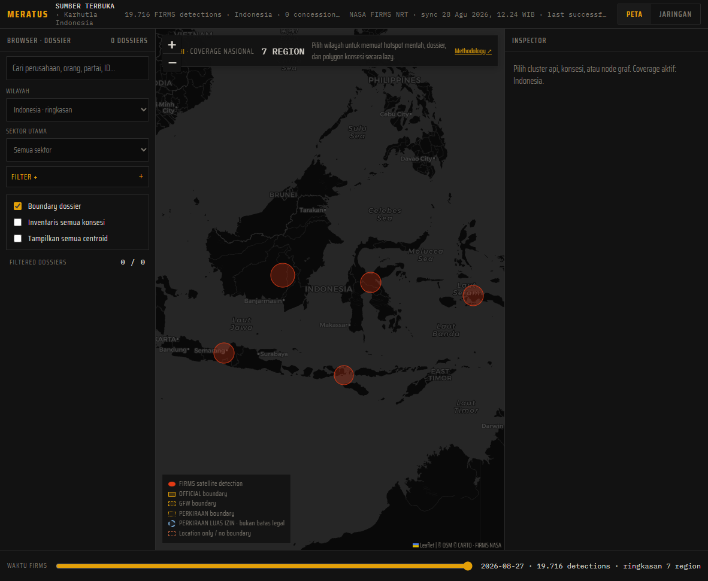
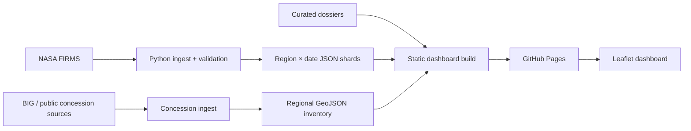
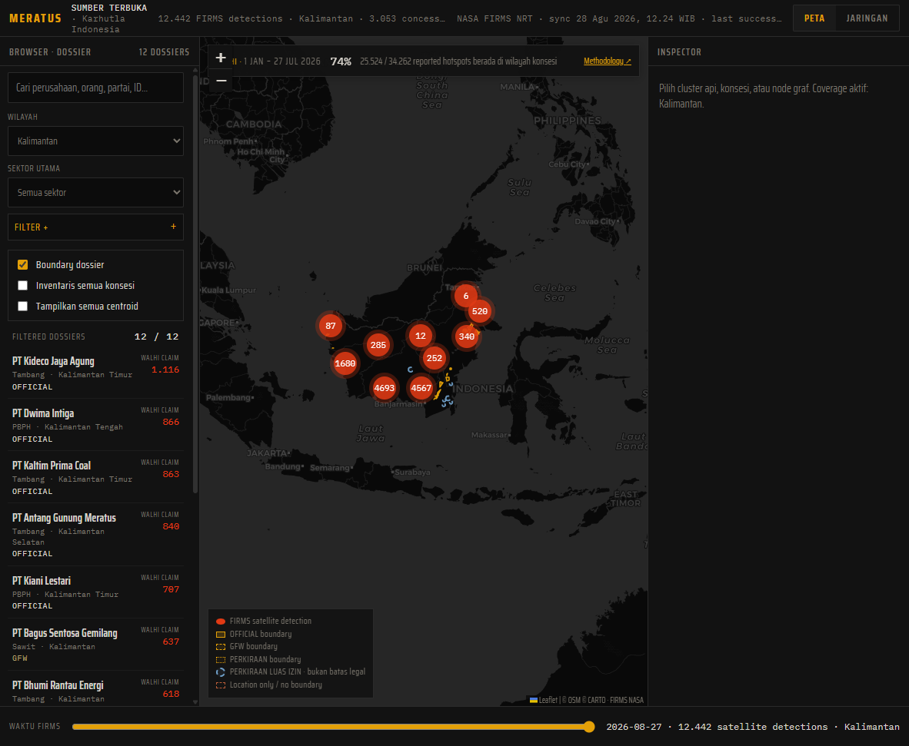
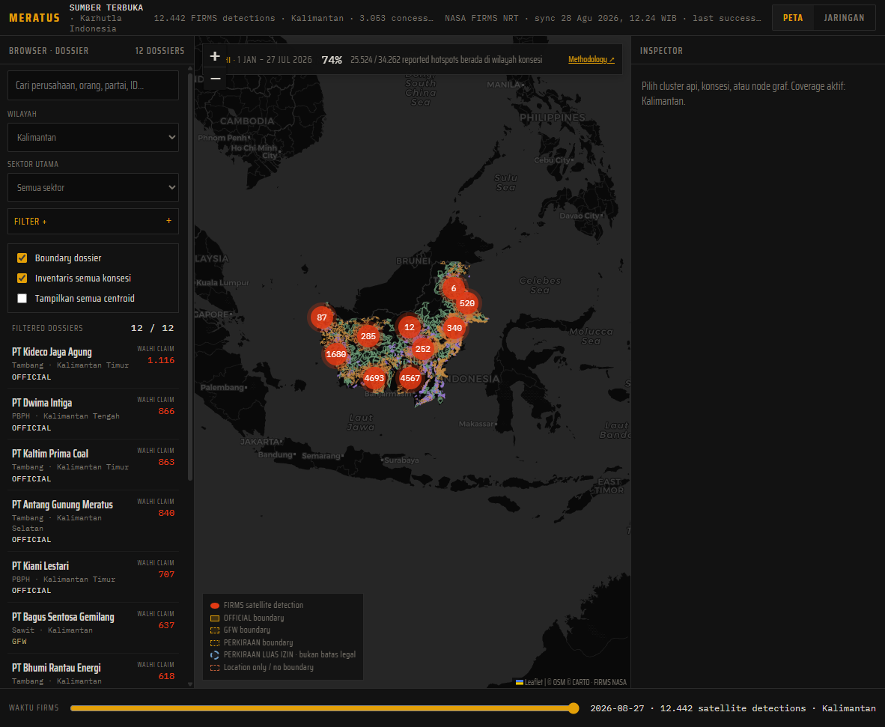
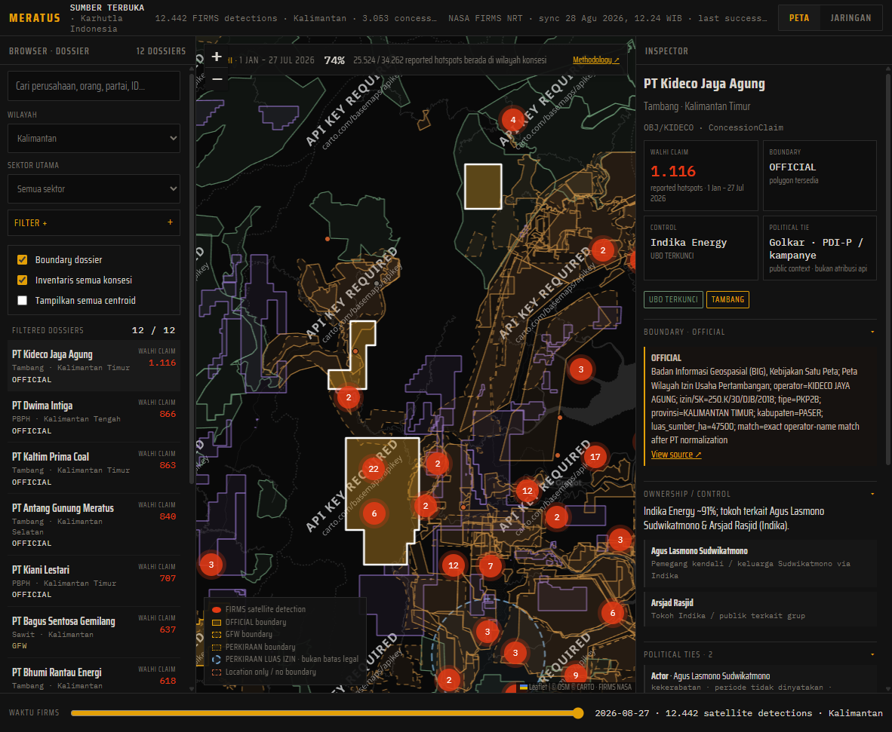

# MERATUS

[](https://github.com/chndranndr/fire-tracker/actions/workflows/pages.yml)
[](https://github.com/chndranndr/fire-tracker/actions/workflows/firms-nrt.yml)
[](LICENSE)
[](https://chndranndr.github.io/fire-tracker/)



**MERATUS** is a lightweight geospatial intelligence dashboard for monitoring wildfire hotspots across Indonesia. It ingests and validates NASA FIRMS observations, shards them by region and date, overlays public concession datasets, and keeps satellite detections, concession claims, corporate control, and political ties as **separate evidence layers**.

**[Live Demo](https://chndranndr.github.io/fire-tracker/)** · **[Methodology](docs/methodology.md)** · **[Data Sources](DATA_SOURCES.md)**

## Key capabilities

| Capability | Detail |
| --- | --- |
| FIRMS ingestion | Hourly pipeline for VIIRS S-NPP, NOAA-20, NOAA-21 |
| National coverage | 7 logical Indonesia regions with region × date JSON shards |
| Spatial filtering | Point-in-polygon against Indonesia boundary geometry |
| Concession inventory | Nationwide generic concession GeoJSON per region/sector |
| Investigative dossiers | Kalimantan dossier layer with curated OSINT citations |
| Resilience | Last-known-good fallback when ingest fails or data goes stale |
| Deployment | Static GitHub Pages build with shared regression gate |
| Tests | Python ingest/build tests plus Node spatial proximity checks |

**Runtime snapshot** (from `data/hotspots/manifest.json`, synced 2026-08-28): **67,478** detections across **7** regions; Kalimantan investigative dossier covers **12** curated concessions.

## Why this exists

Wildfire signals arrive from many systems with different semantics. Near-real-time satellite feeds need validation so a failed fetch does not break a live dashboard. Nationwide point volume must shard and lazy-load instead of shipping one giant JSON file. Concession and ownership data carry different provenance and quality labels. Sensitive OSINT claims need explicit evidence separation so the UI never collapses detection, concession overlay, corporate control, and political affiliation into a single accusation.

MERATUS keeps those concerns explicit in both data model and UI copy.

## Architecture



See [docs/architecture.md](docs/architecture.md) and [docs/adr/](docs/adr/) for decision history.

## Evidence model

Four layers stay separate end to end:

1. **Detection** — FIRMS thermal observations (not ground-verified fire).
2. **ConcessionClaim** — WALHI/media overlay counts for a fixed reporting period.
3. **Control** — company, group, and person links from named public sources.
4. **PoliticalTie** — party, campaign, family, or cabinet links on individuals.

> Satellite hotspot ≠ verified wildfire. Hotspot inside a concession polygon ≠ fire attribution. Political tie on a person ≠ company guilt.

## Data pipeline

1. **Ingest** — `scripts/ingest_firms.py` fetches NASA FIRMS, deduplicates, classifies points into logical regions, and writes `data/hotspots/<region>/<date>.json`.
2. **Validate** — suspicious drops, empty platforms, or stale timestamps keep the last-known-good shard set (`data/hotspots/status.json`).
3. **Build** — `scripts/build_dashboard.py` bootstraps the shard contract and applies three frontend patches in order.
4. **Gate** — `scripts/validate_build.py` runs the same regression checks on pull requests and before Pages deploy.
5. **Publish** — hourly CI uploads a Pages artifact with fresh runtime data. Runtime shards are **not** committed to source history every hour.

Concession inventory GeoJSON lives under `data/concessions/<region>/inventory/`. Kalimantan investigative dossiers live in `data/dossiers/kalimantan.json`.

## Screenshots

| National overview | Kalimantan investigative view |
| --- | --- |
|  |  |

| Concession inventory | Dossier inspector |
| --- | --- |
|  |  |

## Local development

```bash
python scripts/build_dashboard.py
python -m http.server 8765
```

Open http://127.0.0.1:8765/index.html.

`build_dashboard.py` patches `index.html` in the working tree. Restore the template after local testing with `git restore index.html`.

Run the full regression gate:

```bash
python scripts/validate_build.py
```

## Testing

- `python -m unittest discover -s tests -p 'test_*.py' -v`
- `node tests/test_spatial_proximity.js`
- `python scripts/validate_build.py` (combined gate used in CI)

Pull-request validation is offline and does not depend on live NASA availability.

## Limitations

- Kalimantan has the most complete investigative dossier layer; other regions show FIRMS hotspots and generic concession inventory where available.
- WALHI concession overlay counts are period-bound claims, not a live FIRMS × polygon join.
- Political and ownership fields require human-verifiable citations; gaps remain `UNKNOWN` or `TIDAK TERPETAKAN`.
- Static hosting only. No backend, auth, or realtime WebSocket stream.

## License

MERATUS source code is [MIT licensed](LICENSE). Third-party datasets (NASA FIRMS, GFW, BIG, media citations, etc.) remain under their own terms. See [DATA_SOURCES.md](DATA_SOURCES.md).
