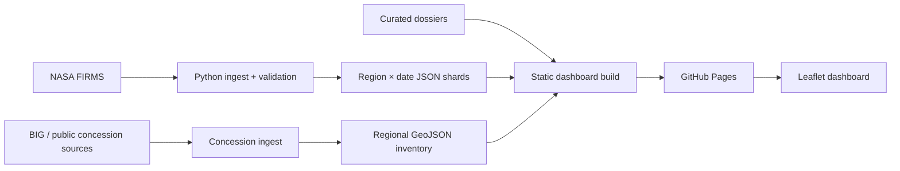

# MERATUS architecture

MERATUS is a static geospatial dashboard. Source code, curated dossiers, and checked-in reference data live in git. Fresh FIRMS runtime shards are produced in CI and shipped as a GitHub Pages artifact without hourly source commits.

## System flow

## Components

| Component | Path / workflow | Role |
| --- | --- | --- |
| FIRMS ingest | `scripts/ingest_firms.py`, `.github/workflows/firms-nrt.yml` | Fetch, validate, shard hotspots |
| Shard bootstrap | `scripts/bootstrap_hotspot_shards.py` | Ensure manifest contract exists |
| Dashboard build | `scripts/build_dashboard.py` | Apply ordered frontend patches |
| Regression gate | `scripts/validate_build.py` | Shared PR and deploy validation |
| Pages deploy | `.github/workflows/pages.yml`, firms-nrt deploy job | Publish static site |
| Frontend | `index.html` + patches | Leaflet map, lazy loaders, inspector |
| Dossiers | `data/dossiers/` | Investigative Kalimantan evidence graph |
| Concession inventory | `data/concessions/<region>/inventory/` | Broad public concession catalog |

## Evidence boundaries

Detection, ConcessionClaim, Control, and PoliticalTie never merge in storage or UI. See [ADR 001](adr/001-evidence-layers.md).

## Related decisions

- [ADR 004 — Region/date sharding](adr/004-region-date-sharding.md)
- [ADR 005 — Build-time frontend composition](adr/005-build-time-frontend-composition.md)
- [ADR 006 — Runtime data publication](adr/006-runtime-data-publication.md)
- [ADR 007 — Dossier vs inventory separation](adr/007-dossier-inventory-separation.md)
