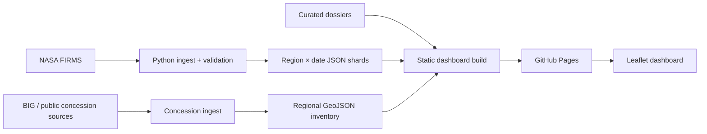

# MERATUS Improvement Plan

Dokumen ini merangkum perbaikan yang perlu dilakukan sebelum MERATUS dipromosikan secara luas, terutama melalui LinkedIn dan portfolio profesional.

Tujuan utama bukan menambah kompleksitas teknis, tetapi meningkatkan **credibility, repository presentation, deployment safety, dan sustainability** tanpa mengubah arsitektur ringan yang sudah sesuai dengan kebutuhan proyek.

## Prinsip

- Pertahankan arsitektur ringan: vanilla HTML/CSS/JS + Python pipeline + GitHub Actions.
- Jangan rewrite ke React/Next.js/backend/database hanya untuk terlihat lebih kompleks.
- Utamakan akurasi data dan provenance dibanding menambah fitur visual.
- Pisahkan dengan tegas empat lapisan bukti: `Detection`, `ConcessionClaim`, `Control`, dan `PoliticalTie`.
- Jangan menambah klaim ownership, afiliasi politik, atau boundary tanpa sumber yang dapat diverifikasi.
- Perubahan pada tahap ini harus meningkatkan kesiapan publikasi, bukan memperluas scope produk.

---

# Phase 0 — Publication Blockers

Target: repo layak dipublikasikan dan dibagikan ke recruiter tanpa menimbulkan masalah kredibilitas yang mudah ditemukan.

## P0.1 — Audit dan perbaiki citation sensitif

### Masalah

Beberapa klaim terkait ownership, hubungan keluarga, kampanye, atau afiliasi politik masih menggunakan URL homepage/generic source, bukan halaman spesifik yang secara langsung mendukung klaim.

Contoh kategori yang wajib diaudit:

- hubungan individu dengan perusahaan/grup;
- jabatan partai;
- peran kampanye;
- hubungan keluarga yang dipakai sebagai political tie;
- beneficial ownership / controlling shareholder;
- status kabinet atau jabatan publik.

### Implementasi

Untuk setiap `dossiers[].sources` dan `politicalTies[].sources`:

1. Pastikan URL mengarah ke halaman/artikel/dokumen spesifik.
2. Pastikan source benar-benar mendukung klaim yang ditampilkan.
3. Jika source tidak cukup kuat:
   - ganti dengan source yang lebih spesifik;
   - downgrade `confidence`; atau
   - hapus political tie / klaim tersebut.
4. Jangan memakai homepage organisasi/media sebagai proxy citation kecuali klaim memang terdapat langsung di halaman tersebut.
5. Pertahankan status eksplisit `UNKNOWN` / `TIDAK TERPETAKAN` bila bukti tidak tersedia.

### Acceptance criteria

- [ ] Tidak ada political tie yang hanya didukung homepage media/partai/perusahaan.
- [ ] Setiap ownership/control claim punya source spesifik.
- [ ] Setiap `sources` ID yang direferensikan oleh `politicalTies` resolve ke source yang valid.
- [ ] Confidence level sesuai kekuatan bukti.
- [ ] Tidak ada wording yang mengubah afiliasi publik menjadi atribusi kebakaran.

---

## P0.2 — Tambahkan license yang jelas

### Masalah

Repository public dan dideskripsikan sebagai open-source, tetapi belum memiliki license source code yang eksplisit.

Selain itu, source code dan dataset pihak ketiga tidak boleh dianggap memiliki license yang sama.

### Implementasi

Tambahkan:

```text
LICENSE
DATA_SOURCES.md
```

`LICENSE` hanya mengatur source code MERATUS.

`DATA_SOURCES.md` minimal memuat:

- NASA FIRMS;
- BIG / Kebijakan Satu Peta;
- GFW;
- Natural Earth;
- WALHI-derived claims / media citations;
- SIPONGI / Kemenhut;
- sumber perusahaan, IDX, media, dan sumber OSINT lain bila relevan.

Untuk setiap kategori dataset, catat:

- source;
- URL;
- fungsi dalam MERATUS;
- retrieval method;
- provenance/quality label;
- licensing/terms reference bila tersedia;
- caveat penggunaan.

README harus menjelaskan bahwa third-party data tetap tunduk pada terms/license masing-masing.

### Acceptance criteria

- [ ] `LICENSE` tersedia di root.
- [ ] GitHub mendeteksi license repository.
- [ ] `DATA_SOURCES.md` tersedia.
- [ ] README membedakan license code dan third-party datasets.
- [ ] Tidak ada klaim bahwa semua data otomatis berada di bawah license source code.

---

## P0.3 — Ubah README menjadi portfolio landing page

### Masalah

README saat ini lebih dekat ke operator/developer manual. Visitor dari LinkedIn seharusnya dapat memahami value project dalam 10–20 detik tanpa menjalankan script.

### Target struktur README

```text
# MERATUS

Hero screenshot

1–2 sentence value proposition

[Live Demo] [Methodology] [Data Sources]

Key capabilities / current metrics

Why this exists

Architecture

Evidence model

Data pipeline

Local development

Testing

Limitations

License
```

### Above-the-fold content

README bagian paling atas harus menjawab:

1. Apa MERATUS?
2. Data apa yang diproses?
3. Apa yang membedakannya dari map demo biasa?
4. Bisa dicoba di mana?

Contoh positioning:

> MERATUS is a lightweight geospatial intelligence dashboard for monitoring wildfire hotspots across Indonesia. It ingests and validates NASA FIRMS observations, shards them by region/date, overlays public concession datasets, and keeps satellite detections, concession claims, corporate control, and political ties as separate evidence layers.

### Tambahkan ringkasan engineering

Tampilkan secara singkat:

- hourly NASA FIRMS ingestion;
- S-NPP / NOAA-20 / NOAA-21;
- 7 logical Indonesia regions;
- region/date sharding;
- spatial filtering and point-in-polygon;
- concession inventory;
- last-known-good fallback;
- automated GitHub Pages deployment;
- test coverage untuk ingestion/build/spatial behavior.

Gunakan angka runtime hanya jika diambil dari manifest/status terbaru. Jangan hard-code angka yang cepat stale tanpa label tanggal.

### Acceptance criteria

- [ ] Hero screenshot tampil sebelum setup instructions.
- [ ] Live Demo terlihat tanpa scroll panjang.
- [ ] Value proposition dapat dipahami tanpa membaca methodology.
- [ ] Architecture summary tersedia.
- [ ] Evidence-layer disclaimer tetap terlihat.
- [ ] Local setup dipindahkan ke bagian bawah README.

---

## P0.4 — Lengkapi GitHub repository metadata

### Implementasi

Set repository metadata:

**Website**

- GitHub Pages production URL.

**Topics**

Rekomendasi:

```text
gis
geospatial
nasa-firms
wildfire
leaflet
open-data
indonesia
osint
```

Hindari terlalu banyak topic yang tidak relevan.

### Acceptance criteria

- [ ] Website field membuka production dashboard.
- [ ] Topics tersedia dan relevan.
- [ ] Description konsisten dengan scope terbaru: Indonesia-wide hotspot dashboard dengan investigative concession/dossier layer yang saat ini paling lengkap di Kalimantan.

---

## P0.5 — Tambahkan social preview / OpenGraph metadata

### Implementasi

Tambahkan metadata ke `<head>`:

```html
<meta name="description" content="...">
<meta property="og:title" content="MERATUS — Indonesia Wildfire Intelligence Dashboard">
<meta property="og:description" content="...">
<meta property="og:type" content="website">
<meta property="og:image" content="...">
<meta name="twitter:card" content="summary_large_image">
```

Buat preview image sekitar 1200×630 yang menampilkan:

- MERATUS branding;
- Indonesia/Kalimantan map;
- hotspot cluster;
- concession polygon;
- UI yang cukup terbaca pada thumbnail.

Gunakan image yang sama atau versi serupa sebagai GitHub Social Preview.

### Acceptance criteria

- [ ] LinkedIn link preview menampilkan title, description, dan image yang benar.
- [ ] GitHub Social Preview tidak kosong/default.
- [ ] Preview tidak memuat klaim politik atau angka yang mudah stale sebagai headline utama.

---

# Phase 1 — Engineering Reliability

Target: production deployment lebih dapat dipercaya tanpa menambah infra baru.

## P1.1 — Jadikan test suite production deployment gate

### Masalah

Test suite sudah cukup meaningful, tetapi full validation lebih dominan dijalankan pada pull request. Deployment Pages seharusnya tidak mem-publish build yang belum melewati regression checks yang sama.

### Implementasi

Sebelum `upload-pages-artifact` / `deploy-pages`, jalankan minimal:

```bash
python -m py_compile scripts/*.py
python -m unittest discover -s tests -p 'test_*.py' -v
node tests/test_spatial_proximity.js
```

Setelah patch frontend dijalankan:

```bash
node --check /tmp/meratus-inline.js
```

Gunakan helper script bila duplication antara workflow mulai terlalu besar, misalnya:

```text
scripts/validate_build.py
```

atau shell command yang reusable. Jangan menambah CI framework baru hanya untuk ini.

### Acceptance criteria

- [ ] Production Pages tidak deploy jika regression test gagal.
- [ ] Syntax JS hasil patched build tervalidasi.
- [ ] PR validation dan production validation menggunakan invariant yang sama.
- [ ] Live network availability NASA tidak dijadikan syarat merge PR.

---

## P1.2 — Hentikan pertumbuhan Git history akibat hourly dataset snapshots

### Masalah

FIRMS ingestion berjalan hourly dan saat ini dapat menghasilkan commit data berulang ke `main`. Walaupun file lama dihapus atau ditimpa, Git history tetap menyimpan blob lama.

Dalam jangka panjang ini akan membuat repository membesar tanpa memberikan nilai besar pada source history.

### Target architecture

```text
NASA FIRMS
    ↓
ingest
    ↓
validate
    ↓
produce runtime shards
    ↓
GitHub Pages artifact
    ↓
deploy
```

Hourly runtime data tidak harus menjadi commit source-code.

### Opsi yang disarankan

#### Opsi A — Artifact-only runtime data

- scheduled workflow checkout source;
- fetch + validate FIRMS;
- generate shard runtime;
- patch/build dashboard;
- upload Pages artifact;
- deploy;
- tidak melakukan `git push` hourly.

Ini opsi paling sederhana jika historical Git snapshots tidak diperlukan.

#### Opsi B — Pisahkan data branch/repository

Jika historical data memang diperlukan:

- source code tetap di `main`;
- generated data disimpan di branch/repository khusus;
- lakukan retention/compaction yang eksplisit.

Jangan menambah database/object storage sebelum ada kebutuhan nyata.

### Snapshot policy

Jika reproducibility membutuhkan checked-in data:

- commit snapshot harian atau mingguan saja;
- jangan commit setiap successful hourly fetch;
- simpan metadata timestamp dan source counts.

### Acceptance criteria

- [ ] Scheduled hourly FIRMS tidak lagi menghasilkan commit terus-menerus ke source history.
- [ ] Production dashboard tetap dapat menampilkan data terbaru.
- [ ] Last-known-good behavior tetap tersedia.
- [ ] Reproducibility minimal tetap terjaga melalui metadata atau periodic snapshot.

---

## P1.3 — Satukan build orchestration

### Masalah

Dashboard production membutuhkan patch script berurutan:

1. `patch_land_holdings_dashboard.py`
2. `patch_region_dashboard.py`
3. `patch_concession_inventory_dashboard.py`

Urutan ini tersebar di README dan workflow sehingga mudah drift.

### Implementasi

Tambahkan satu entry point:

```text
scripts/build_dashboard.py
```

Tanggung jawab:

1. ensure hotspot shard contract;
2. copy/use clean `index.html` source;
3. apply patches dalam urutan yang benar;
4. validate expected markers/invariants;
5. optionally emit final build path/status.

Jangan merge seluruh patch logic ke satu file besar. `build_dashboard.py` cukup menjadi orchestrator.

Workflow menjadi:

```bash
python scripts/build_dashboard.py
python scripts/validate_build.py
```

### Acceptance criteria

- [ ] Hanya ada satu documented command untuk membuat production frontend.
- [ ] Local build dan GitHub Actions menggunakan entry point yang sama.
- [ ] Urutan patch tidak diduplikasi di banyak tempat.
- [ ] Existing patch scripts tetap independently testable.

---

# Phase 2 — Documentation Integrity

Target: dokumentasi menggambarkan implementasi aktual dan evolution arsitektur.

## P2.1 — Update README terhadap implementasi terbaru

Pastikan README mencakup:

- 3 frontend patch/build steps atau single build orchestrator baru;
- national region/date hotspot shards;
- nationwide generic concession inventory;
- Kalimantan investigative dossier status;
- current CI/CD behavior;
- current fallback/last-known-good semantics.

### Acceptance criteria

- [ ] Tidak ada command/deployment flow yang obsolete.
- [ ] Data paths di README cocok dengan source tree.
- [ ] Scope Indonesia vs Kalimantan dijelaskan dengan benar.

---

## P2.2 — Supersede ADR yang sudah stale

Jangan menghapus ADR lama karena menunjukkan evolution keputusan.

Untuk ADR yang tidak lagi menggambarkan runtime sekarang:

```text
Status: Superseded by ADR-00X
```

Buat ADR baru untuk keputusan besar seperti:

- region/date sharding;
- build-time frontend composition;
- generated runtime data publication strategy;
- separation of investigative dossier boundaries vs generic concession inventory.

### Acceptance criteria

- [ ] ADR lama tetap tersedia sebagai historical context.
- [ ] Current architecture punya ADR yang jelas.
- [ ] Tidak ada ADR `Accepted` yang bertentangan langsung dengan implementasi production.

---

## P2.3 — Tambahkan architecture diagram sederhana

Gunakan Mermaid di README atau `docs/architecture.md`.

Contoh level yang cukup:



Tidak perlu C4 multi-level untuk project ini kecuali kebutuhan dokumentasi tumbuh.

### Acceptance criteria

- [ ] Recruiter dapat memahami system flow dalam satu diagram.
- [ ] Diagram sesuai implementasi.
- [ ] Tidak ada komponen fiktif atau planned-only yang digambar sebagai production.

---

# Phase 3 — Portfolio Polish

Target: meningkatkan first impression tanpa mengubah core product.

## P3.1 — Screenshot set

Sediakan 2–4 screenshot di `docs/assets/`:

1. national overview;
2. Kalimantan investigative view;
3. concession inventory enabled;
4. dossier/graph inspector.

README cukup menampilkan hero + satu atau dua screenshot tambahan.

### Acceptance criteria

- [ ] Screenshot berasal dari production build.
- [ ] Tidak menampilkan broken/stale/fallback state kecuali memang sedang menjelaskan fallback.
- [ ] Sensitive claims pada screenshot tetap memiliki caveat/context yang terlihat.

---

## P3.2 — Status badges secukupnya

Maksimal beberapa badge yang benar-benar berguna:

- CI / build;
- FIRMS pipeline;
- license;
- live demo.

Jangan membuat badge wall.

### Acceptance criteria

- [ ] Semua badge resolve dan menunjukkan workflow aktual.
- [ ] Tidak ada badge vanity yang tidak memberikan informasi.

---

## P3.3 — Tambahkan concise project story

README dapat memiliki bagian singkat `Why I built this`.

Fokus pada engineering problem:

- wildfire data tersebar dan memiliki semantics berbeda;
- near-real-time data perlu divalidasi agar failure tidak merusak live dashboard;
- nationwide point volume perlu di-shard/lazy-load;
- concession data memiliki provenance/quality berbeda;
- sensitive OSINT claims perlu evidence separation.

Hindari framing partisan atau klaim kausal yang tidak didukung data.

### Acceptance criteria

- [ ] Story menjelaskan problem dan engineering decisions.
- [ ] Tidak berubah menjadi opini politik panjang.
- [ ] Recruiter bisa melihat skill engineering yang relevan dari project story.

---

# Phase 4 — Optional Follow-up

Kerjakan hanya setelah publication readiness selesai dan ada alasan nyata.

## P4.1 — Performance budget

Tambahkan lightweight checks untuk:

- total initial payload;
- largest JSON shard;
- largest GeoJSON shard;
- marker rendering responsiveness;
- mobile viewport usability.

Tidak perlu Lighthouse CI kompleks pada tahap awal.

## P4.2 — Better runtime observability

Jika pipeline semakin penting, expose status file yang mudah dibaca:

```json
{
  "pipelineStatus": "healthy",
  "lastSuccessfulSync": "...",
  "newestDetectionUtc": "...",
  "sourceCounts": {...}
}
```

Sebagian sudah ada; fokus pada konsistensi antar pipeline.

## P4.3 — Data validation schema

Jika JSON contracts semakin sering berubah, pertimbangkan schema formal untuk:

- hotspot manifest;
- region shard;
- dossier;
- concession inventory manifest.

Gunakan JSON Schema atau validator Python ringan. Jangan lakukan ini jika manual invariant tests masih cukup.

---

# Explicit Non-Goals

Jangan lakukan sebelum ada kebutuhan nyata:

- rewrite frontend ke React/Next.js;
- membuat Spring Boot/Node backend;
- menambah PostgreSQL/PostGIS hanya karena project GIS;
- Kubernetes deployment;
- user authentication;
- microservice split;
- realtime WebSocket stream;
- AI chatbot hanya untuk menambah label AI;
- machine-learning fire attribution;
- auto-generated ownership/political relationship tanpa human-verifiable evidence;
- heavy GIS join di browser.

---

# Recommended Execution Order

## Before LinkedIn post

1. [ ] Audit sensitive citations.
2. [ ] Add code license + data provenance/licensing document.
3. [ ] Rewrite README top section.
4. [ ] Add hero screenshot and Live Demo link.
5. [ ] Set GitHub Website + topics.
6. [ ] Add OpenGraph/social preview metadata.
7. [ ] Fix documentation drift that is visible from README.

## Immediately after / parallel

8. [ ] Gate production deployment with current tests.
9. [ ] Stop hourly data commits from bloating source Git history.
10. [ ] Add a single build orchestration entry point.
11. [ ] Supersede stale ADRs and document current architecture.
12. [ ] Add concise architecture diagram.

## Later only if useful

13. [ ] Performance budget.
14. [ ] Stronger runtime status observability.
15. [ ] Formal JSON schemas.

---

# Definition of Done for Public Portfolio Release

MERATUS dianggap siap untuk dipromosikan sebagai portfolio project ketika:

- [ ] Live demo dapat dibuka langsung dari GitHub repository.
- [ ] README menjelaskan value project dalam 10–20 detik pertama.
- [ ] Hero/social preview terlihat profesional.
- [ ] Code memiliki explicit license.
- [ ] Third-party data provenance/licensing didokumentasikan terpisah.
- [ ] Sensitive OSINT claims menggunakan direct, defensible citations.
- [ ] Evidence layers tetap terpisah dan disclaimer tidak dilemahkan.
- [ ] Production deployment gagal jika regression test gagal.
- [ ] Hourly data refresh tidak menyebabkan pertumbuhan Git history tanpa batas.
- [ ] README, methodology, workflow, dan ADR tidak saling bertentangan secara material.
- [ ] Tidak ada fitur tambahan yang dibangun hanya untuk membuat architecture terlihat lebih kompleks.

Setelah checklist ini terpenuhi, improvement berikutnya harus didorong oleh usage/data quality/performance problem yang nyata, bukan oleh kebutuhan untuk menambah technology stack.